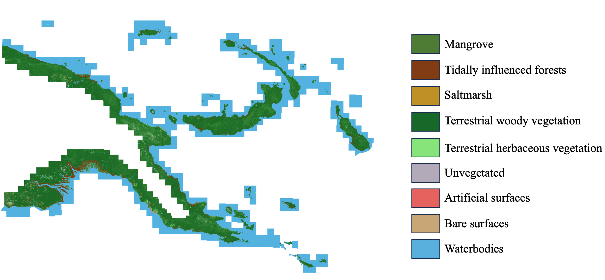

#  Living Earth - Papua New Guinea (PNG)

### Demonstrating the transferability and translational capacity of the Living Earth systen to map blue carbon ecosystem (BCE) for Papua New Guinea (PNG)

#

| | |
|-|-|
|__Disclaimer__| This repository is *in development*, use at your own risk |
|__License__| The Apache 2.0 license applies to this open source code. |

### 1. About
This repository includes scripts and notebooks for demonstrating the transferability and translational capacity of the [Living Earth](https://bitbucket.org/au-eoed/livingearth_lccs/src/main/) systen to map blue carbon ecosystem (BCE) for Papua New Guinea (PNG). The project is a collaboration between the CSIRO, University of Newcastle, Aberystwyth University, and Plymouth Marine Laboratory. The project team includes [Dr Chris Owers](https://www.newcastle.edu.au/profile/chris-owers), [Dr Carole Planque](https://research.aber.ac.uk/en/persons/carole-planque-3) , [Dr Dan Clewley](https://www.pml.ac.uk/People/Dr-Daniel-Clewley), [Matt Paget](https://people.csiro.au/P/M/matt-paget), [Professor Richard Lucas](https://research.aber.ac.uk/en/persons/richard-lucas) and [Dr Andy Steven](https://scholar.google.com.au/citations?user=-vCqGB8AAAAJ&hl=en)

### 2. The broader context
As a component of the Pacific Blue Carbon Project (PBCP), this project helps to build analytical processing capacity to enable Papua New Guinea (PNG) to routinely map national mangrove assets and to monitor, report and verify (MRV) the status of associated ecosystems and carbon stocks as part of their National Determined Contributions (NDCs) and Emission inventory obligations.

This analytical capacity is built upon the CSIRO Earth Analytics Science and Innovation [(EASI)](https://research.csiro.au/cceo/underpinning-technologies/earth-analytics/) platform, which utilises the capacity of the Open Data Cube [(ODC)](https://www.opendatacube.org/) to make available Analysis ready data (ARD) from multiple Earth Observation data series. It includes the development and implementation of algorithms, scripts and workflows for the integration/refinement of existing maps and other products into a broad land cover product.

### 3. What this repository contains
This research project aimed to evaluate Living Earth for obtaining consistent and quantified information on blue carbon ecosystem states and dynamics. The objectives focused on evaluating a) the transferability of the existing infrastructure to other big data platforms and to a new geography or ecosystem of interest, namely the tropical coastal environments of Papua New Guinea, and b) the translatability of algorithms for extracting environmental descriptors from EO data between countries and regions and constructing comparable classifications of and uncertainty metrics associated with the mapped land covers and changes. For all coastal regions of Papua New Guinea, and using the CSIRO EASI ASIA ODC instance, classifications and linked descriptions of land cover were successfully generated, with these including major blue carbon ecosystems (mangroves, saltmarshes, coastal forested areas) and some terrestrial land covers. Capacity was also introduced for quantifying change according to a globally applicable evidence-based global change taxonomy. The project also highlighted the transferability of these derived products in addressing policy (e.g., IPCC, UNREDD, SEEA, Ecosystem Red Lists) and land management requirements.

### 4. Output products
The output product is a GeoTIFF file containing five bands, where Band 1 represents the vegetated/non-vegetated layer, Band 2 represents the terrestrial/aquatic layer, Band 3 the FAO LCCS Level 3 output, Band 4 the FAO LCCS Level 3 with Level 4 woody/non-woody output, and Band 5; a merged layer showing blue carbon ecosystems (BCE) and relevant FAO LCCS Level 3 and Level 4 land covers. The relevant value codes for each band are provided below. In addition, a RGB image of Band 5 is also provided as a GeoTIFF file (Figure 1). This analysis was completed as an annual snapshot for 2020.

__Figure 1.__ Overview of RGB image of Band 5 including blue carbon ecosystems (BCE) and relevant FAO LCCS Level 3 and Level 4 land covers

### 5. Relevant values and descriptions for each band in the output product
FAO LCCS definitions of descriptions can be looked up [here](https://www.fao.org/land-water/land/land-governance/land-resources-planning-toolbox/category/details/en/c/1036361/#:~:text=The%20Land%20Cover%20Classification%20System,and%20mapping%20of%20land%20cover.)

#### Band 1 values
- 100: vegetated 
- 200: non-vegetated

#### Band 2 values
- 10: terrestrial
- 20: aquatic

#### Band 3 values
- 112: natural terrestrial vegetation
- 124: natural aquatic vegetation
- 200: unvegetated
- 215: artificial surfaces
- 216: natural bare surfaces
- 220: waterbodies

#### Band 4
- 1121: natural terrestrial woody vegetation
- 1122: natural terrestrial herbaceous vegetation
- 1241: natural aquatic woody vegetation
- 1242: natural aquatic herbaceous vegetation
- 2000: unvegetated
- 2150: artificial surfaces
- 2160: natural bare surfaces
- 2200: waterbodies

#### Band 5
- 1: mangrove
- 2: tidally influenced woody vegetation
- 3: saltmarsh
- 1121: natural terrestrial woody vegetation
- 1122: natural terrestrial herbaceous vegetation
- 1241: natural aquatic woody vegetation
- 1242: natural aquatic herbaceous vegetation
- 2000: unvegetated
- 2150: artificial surfaces
- 2160: natural bare surfaces
- 2200: waterbodies
